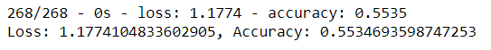
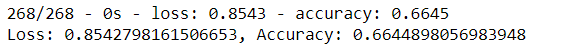

# Neural_Network_Charity_Analysis

## Overview of the Analysis

The purpose of this project is to create a binary classification model using a neural network to predict whether a grant applicant will be successful if funded. 

## Results

#### Data Preprocessing

- The target of the model is the IS_SUCCESSFUL column of the original dataset
- The features of the model are the organization's application type, affiliation, classification, use case, organization, status, income amt, special considerations, and ask amt.
- The EIN and Name columns are not targets or features and were removed from the input data.

#### Compiling, Training, and Evaluating the Model

- For my initial model I used two hidden layers with 8 and 5 neurons. This provided 352 weight parameters, which gave the model sufficient opportunities to find trends without overfitting. I used the relu activation function in the hidden layers to identify nonlinear characteristics from the input values. Finally, I used the sigmoid activation function in the output layer to predict the probability of an applicant's success. 
- My initial model had an accuracy score of 55%, falling short of the target of 75%.
- To improve the model's performance, I reprocessed the data to use fewer bins for the application type and classification categories. I then added additional neurons to the hidden layers, and finally added an additional hidden layer. The most successful version of the model used two hidden layers with 24 and 16 neurons, achieving an accuracy score of 66%.   

## Summary

The model ultimately did not achieve the targeted predictive accuracy of 75%. My initial model had an accuracy score of only 55%. Reducing the number of input variables and adding additional neurons improved the model's accuracy to 66%, still short of the target. An alternative approach to this problem would be to use a support vector machine model instead of a neural network. Because they excel at binary classification problems, and are not as prone to overfitting as neural networks, SVMs could be a promising model to apply to this case.
